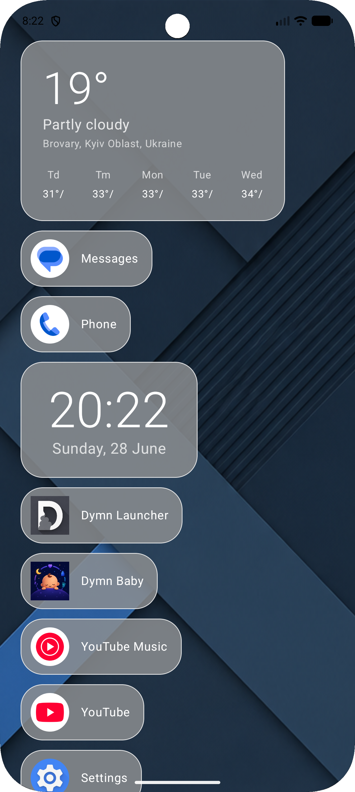
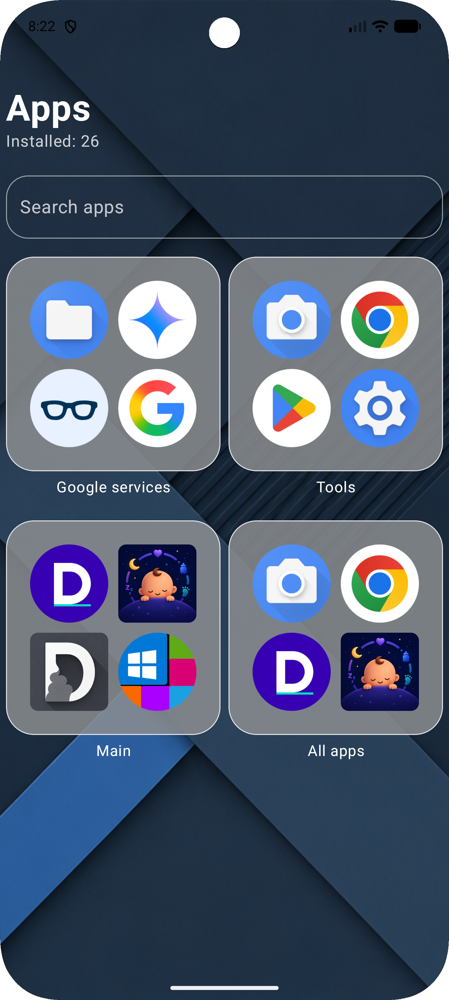
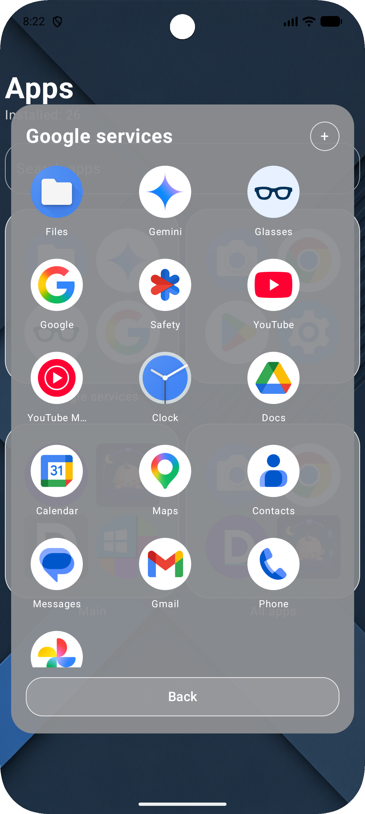
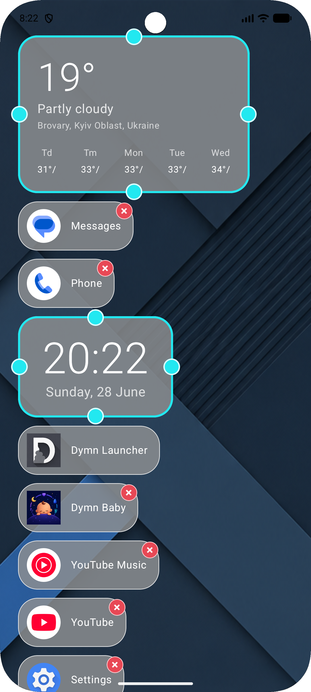
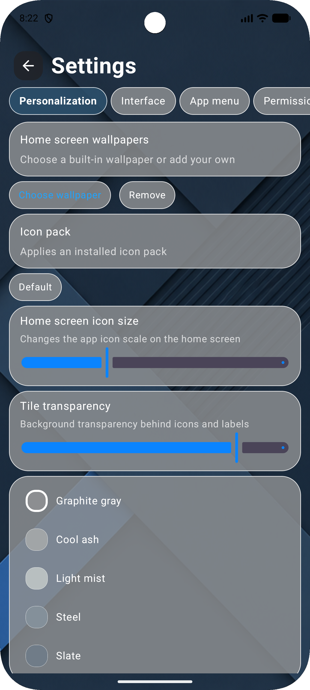
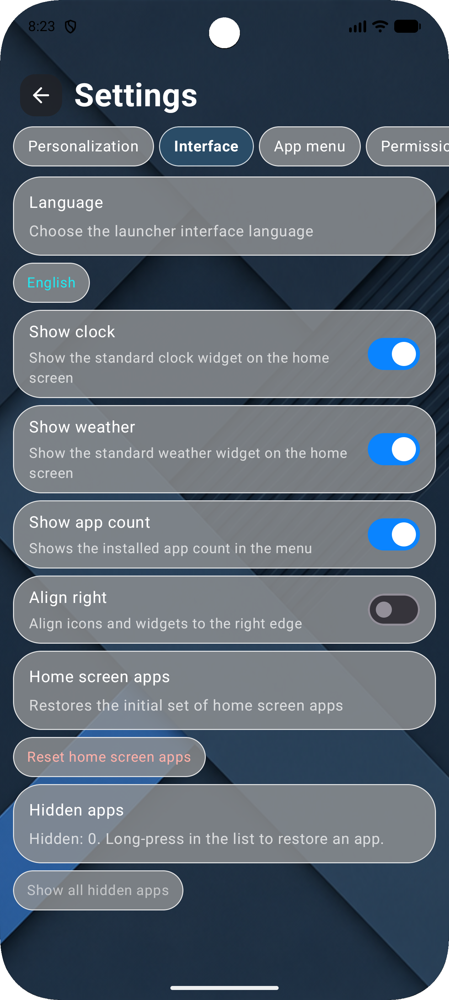
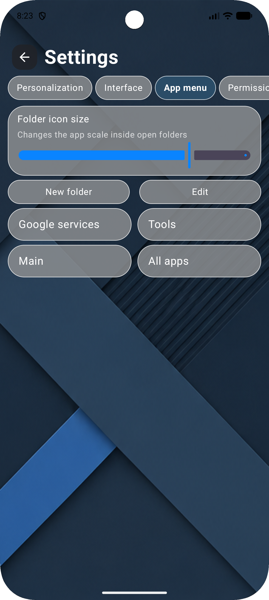
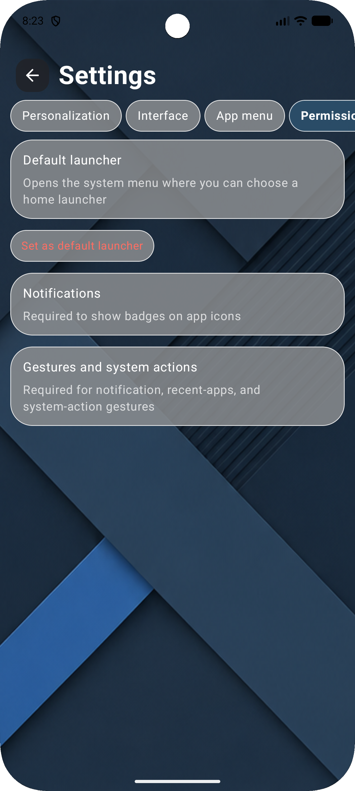

<h1 align="center">Dymn Launcher</h1>

  Minimal Android Launcher built with Kotlin & Jetpack Compose

  
  
  
  
  

**Highly customizable Android launcher inspired by iOS simplicity.**

Dymn Launcher is a clean Android home screen experience focused on speed, personalization and modern visual design.

---

## Preview

  
  
  

---

## Key Features

- Customizable home screen
- App menu with search
- Folder system
- Widget editing and resizing
- Adjustable tile transparency
- Icon pack support
- Wallpaper customization
- English and Ukrainian localization
- Clean iOS-inspired interface

---

## Customization

  
  
  

---

## Settings

  
  
  

---

## Status

**Project status:** Completed  
**Availability:** APK available on request  
**Google Play:** Not published yet

---

## Built with

- Android Studio
- Android SDK
- Java / Kotlin
- Material-inspired UI

---

## About Dymn Studio

Dymn Studio creates modern Android applications with a focus on clean UI, practical features and minimal design.
