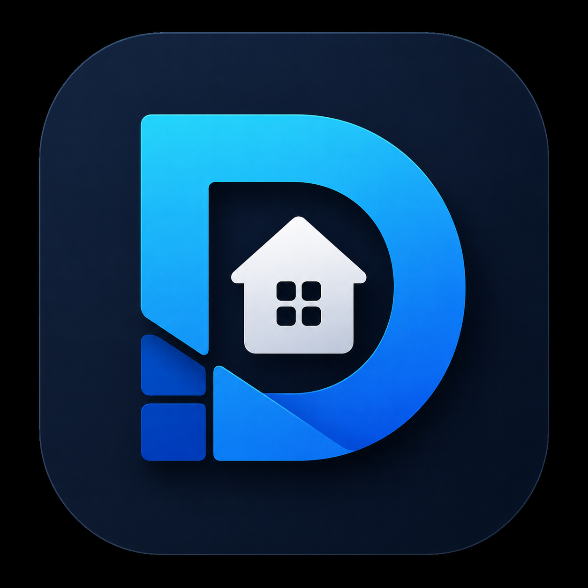
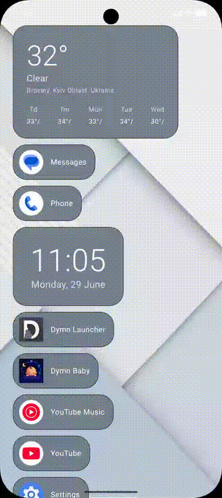
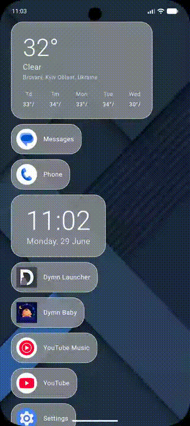
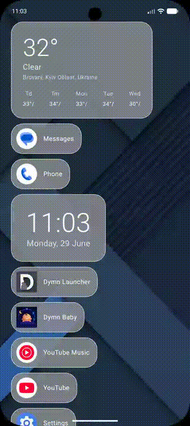
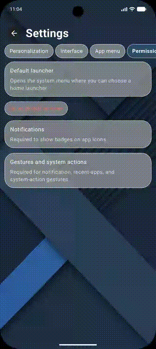
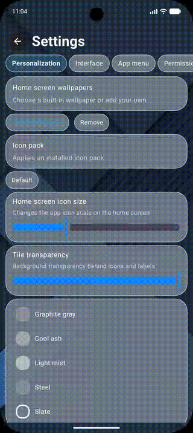

# Dymn Launcher 🚀

  

<h1 align="center">Dymn Launcher</h1>

A modern Metro / Windows Phone inspired Android launcher focused on customization, personalization and performance.

---

---

## Contents

- [Preview](#preview)
- [Key Features](#key-features)
- [Installation](#installation)
- [Screenshots](#screenshots)
- [Roadmap](#roadmap)
- [License](#license)

**Highly customizable Android launcher inspired by iOS simplicity.**

Dymn Launcher is a clean Android home screen experience focused on speed, personalization and modern visual design.

---
## 🎬 Demo

### Interface

  

### Home screen & Edit menu

  
  

### Settings & Folders

  
  

###  Personalization

  
  

## Preview

  
  
  

## Customization

  
  
  

---

## Settings

  
  
  

---

## Key Features

* 🏠 Customizable home screen
* 📂 Folder support
* 🔍 Fast app search
* 🎨 Icon pack support
* 🌈 Custom accent color selection
* 🖼️ Built-in and custom wallpapers
* 👆 Gesture support
* 📱 Widgets support
* ⚙️ Interface personalization
* 🚀 Fast and lightweight performance
* 🧩 Built with Jetpack Compose

---

## Status

**Project status:** Completed  
**Availability:** APK available on request  
**Google Play:** Not published yet

----

## Built with

- Android Studio
- Android SDK
- Java / Kotlin
- Material-inspired UI

---

## About Dymn Studio

Dymn Studio creates modern Android applications with a focus on clean UI, practical features and minimal design.

## Roadmap

- [x] Home screen
- [x] App drawer
- [x] Folder support
- [x] Widgets
- [x] Wallpaper customization
- [x] Search
- [x] Icon pack support
- [x] Gesture support
- [x] Theme customization
- [ ] Backup & Restore
- [ ] Tablet layout
      
